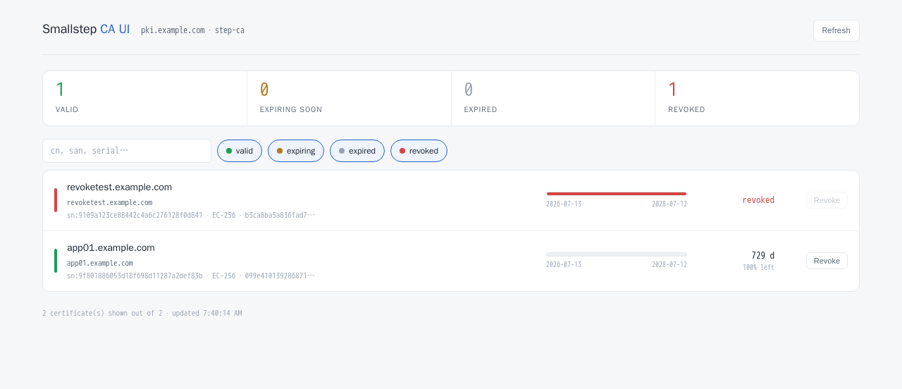

# StepCA-Control

A self-contained Public Key Infrastructure (PKI) management platform built on [`step-ca`](https://smallstep.com/docs/step-ca/) and packaged with Docker Compose.

**StepCA-Control** provides a complete two-tier Certificate Authority architecture with:

* Root CA and Intermediate CA
* PostgreSQL-backed certificate storage
* CRL publication over HTTP
* ACME and JWK certificate issuance
* Certificate revocation
* Certificate issuance directly from the dashboard
* Read-only certificate inventory and inspection
* Authenticated web dashboard
* Optional nginx HTTP Basic Authentication
* Offline root CA key isolation

> **StepCA-Control is designed as a reference deployment.** Review and adapt certificate validity periods, subjects, network exposure, authentication, and operational procedures before using it in production.

---

## Contents

```text
StepCA-Control/
├── .env.example
├── init-ca.sh
├── BUILD/
│   └── Dockerfile
├── volumes/
│   ├── app/
│   │   ├── app.py
│   │   ├── asgi.py
│   │   ├── config.py
│   │   ├── models.py
│   │   ├── services.py
│   │   ├── routes.py
│   │   ├── utils.py
│   │   ├── static/
│   │   └── templates/
│   ├── db/
│   ├── nginx/
│   │   ├── nginx-pki.conf.template
│   │   └── intermediate_ca.crt
│   └── stepca/
│       └── config/
│           └── templates/
│               └── certs/
│                   └── x509/
│                       ├── leaf.tpl.tmpl
│                       └── leaf.tpl
├── secrets/
├── root-ca-offline/
├── docs/
├── docker-compose.yml
├── LICENSE
└── README.md
```

> Generated CA material, passwords, private keys, database files, and other sensitive data are intentionally excluded from version control.

---

## Architecture

```text
                              Docker Network
┌──────────────────────────────────────────────────────────────┐
│                                                              │
│   step CLI / ACME Clients                                    │
│            │                                                 │
│            │ HTTPS :443                                      │
│            ▼                                                 │
│   ┌─────────────────────────────┐                            │
│   │         step-ca             │                            │
│   │                             │                            │
│   │  ┌───────────────────────┐  │                            │
│   │  │ JWK Provisioner       │  │                            │
│   │  ├───────────────────────┤  │                            │
│   │  │ ACME Provisioner      │  │                            │
│   │  ├───────────────────────┤  │                            │
│   │  │ Certificate Authority │  │                            │
│   │  │ CRL Endpoint          │  │                            │
│   │  └───────────────────────┘  │                            │
│   └──────────────┬──────────────┘                            │
│                  │                                           │
│                  ▼                                           │
│   ┌─────────────────────────────┐                            │
│   │       PostgreSQL            │                            │
│   │       Certificate DB         │                            │
│   └─────────────────────────────┘                            │
│                                                              │
│   HTTP :80                                                   │
│      ▲                                                       │
│      │                                                       │
│   ┌──┴──────────────────────────┐                            │
│   │            nginx             │                            │
│   │                              │                            │
│   │  /intermediate_ca.crt        │                            │
│   │  /intermediate_ca.crl        │                            │
│   │  / → StepCA-Control Dashboard│                            │
│   └──────────────────────────────┘                           │
│                                                              │
└──────────────────────────────────────────────────────────────┘
```

---

## Certificate Issuance

StepCA-Control comes with two certificate issuance methods.

### JWK Provisioner

Designed for manual or scripted certificate issuance.

* Password-protected
* Suitable for CLI and automation
* Default certificate lifetime: 2 years

### ACME Provisioner

Designed for automated certificate issuance using standard ACME clients.

* Challenge-based issuance
* Compatible with ACME tooling
* Default certificate lifetime: 90 days

---

## Requirements

* Docker
* Docker Compose v2
* Bash
* OpenSSL
* A DNS name pointing to the host running StepCA-Control

Example:

```text
pki.example.com
```

---

## Quick Start

### 1. Configure the PKI hostname

```bash
cp .env.example .env
```

Edit `.env`:

```env
CA_DNS=pki.example.com
```

`CA_DNS` is the single source of truth for the PKI hostname.

It is automatically used to configure:

* `step-ca`
* `ca.json`
* Certificate templates
* CRL and AIA URLs
* nginx
* The StepCA-Control dashboard
* JWT audiences used by the dashboard

---

### 2. Initialize the Certificate Authority

Run the initialization script once:

```bash
bash init-ca.sh
```

The script is idempotent.

To force a complete regeneration:

```bash
bash init-ca.sh --force
```

The initialization process creates:

* Root CA
* Intermediate CA
* CA private keys
* CA configuration
* JWK provisioner
* ACME provisioner
* PostgreSQL credentials
* CA key passwords
* Certificate templates
* CRL configuration

The root CA fingerprint is printed during initialization.

> Save the fingerprint. It is required to bootstrap trust on clients.

---

### 3. Start the services

```bash
docker compose up -d
```

Check the running containers:

```bash
docker compose ps
```

---

### 4. Trust the Root CA

The Root CA certificate is available at:

```text
volumes/stepca/certs/root_ca.crt
```

Install this certificate in the trust store of your clients.

---

## Root CA Security

StepCA-Control uses a two-tier CA architecture.

```text
                 Root CA
                    │
                    │ signs
                    ▼
             Intermediate CA
                    │
          ┌─────────┴─────────┐
          │                   │
      Server Certs        Client Certs
```

The Root CA is used only to sign the Intermediate CA.

After initialization:

```text
root-ca-offline/
├── root_ca
├── root_ca.crt
└── root_password
```

The Root CA private key should be:

1. Backed up securely.
2. Removed from the online CA host.
3. Stored offline or in a secure secrets management system.

The running `step-ca` instance only requires the Intermediate CA key.

This limits the impact of a compromise of the online CA infrastructure.

---

## Verifying the Deployment

### Check the CA health

```bash
docker exec pki \
  curl -sk https://localhost:443/health
```

Expected response:

```json
{"status":"ok"}
```

---

### List provisioners

```bash
docker exec pki step ca provisioner list
```

---

### Check CRL generation

```bash
docker exec pki \
  curl -sk https://localhost:443/crl -o /tmp/crl.der

openssl crl \
  -inform DER \
  -in /tmp/crl.der \
  -noout \
  -lastupdate \
  -nextupdate
```

---

### Check HTTP distribution

```bash
source .env

curl -sI http://$CA_DNS/intermediate_ca.crt
curl -s http://$CA_DNS/intermediate_ca.crl \
  | openssl crl -inform DER -noout -nextupdate
```

---

## Issuing Certificates

### Using the JWK Provisioner

Bootstrap trust on a client:

```bash
step ca bootstrap \
  --ca-url https://$CA_DNS \
  --fingerprint <ROOT_FINGERPRINT>
```

Issue a certificate:

```bash
step ca certificate \
  web01.example.com \
  web01.crt \
  web01.key \
  --provisioner jwk \
  --ca-url https://$CA_DNS \
  --san web01.example.com \
  --password-file volumes/stepca/secrets/provisioner_pwd
```

---

### Using ACME

The ACME directory is available at:

```text
https://<CA_DNS>/acme/acme/directory
```

Example:

```bash
certbot certonly \
  --standalone \
  --server https://$CA_DNS/acme/acme/directory \
  -d web01.example.com
```

The client must trust the Root CA before connecting to the private CA.

---

# StepCA-Control Dashboard



The StepCA-Control dashboard provides a centralized view of certificates issued by the PKI.

The dashboard displays:

* Certificate subject
* Subject Alternative Names
* Issuer
* Serial number
* Fingerprint
* Validity period
* Certificate status
* Key type
* Provisioner

Supported statuses include:

* Valid
* Expiring
* Expired
* Revoked

---

## Certificate Details


Each certificate can be inspected to view:

* Subject DN
* Issuer DN
* SANs
* Serial number
* Fingerprint
* Key algorithm
* Validity dates
* Provisioner
* Current certificate status

---

## Certificate Issuance from the Dashboard


The dashboard can issue certificates directly through the `step-ca` API.

Supported certificate types:

* Server certificates
* Client certificates

Supported key algorithms:

* EC P-256
* EC P-384
* EC P-521
* RSA 2048
* RSA 3072
* RSA 4096

The generated certificate package can include:

* Certificate
* Full certificate chain
* Private key
* PKCS#12 bundle


Private keys and generated certificate packages are not stored server-side after issuance.

---

## Dashboard Authentication

The dashboard requires authentication.

On first startup, a default `admin` user is created with a randomly generated password.

Retrieve it from the logs:

```bash
docker compose logs pki-dashboard \
  | grep "default dashboard user"
```

Create another user:

```bash
docker exec -it pki-dashboard \
  flask --app app create-user <username>
```

Passwords are stored as salted password hashes using Werkzeug.

> Application authentication should not be considered a replacement for network segmentation or access control.

---

## Certificate Revocation

Certificate revocation is available through the dashboard.

The dashboard communicates with `step-ca` through its HTTP API using a provisioner-signed token.

No Docker socket is required.

No `step` subprocess is required for dashboard revocation.

Manual revocation is also possible:

```bash
docker exec -it pki \
  step ca revoke <serial> \
  --ca-url https://$CA_DNS \
  --root /home/step/certs/root_ca.crt
```

---

## CRL and AIA Distribution

The intermediate CA certificate is published at:

```text
http://<CA_DNS>/intermediate_ca.crt
```

The CRL is published at:

```text
http://<CA_DNS>/intermediate_ca.crl
```

Certificates issued by StepCA-Control include the relevant distribution points.

The HTTP endpoint must therefore remain available for clients performing certificate validation.

---

## Operations

### Reload the CA configuration

After modifying `ca.json`:

```bash
docker kill -s HUP pki
```

---

### Inspect a certificate

```bash
step certificate inspect web01.crt --short
```

---

### Backup the PostgreSQL database

```bash
docker exec pki-db \
  pg_dump -U stepca stepca \
  > stepca-$(date +%F).sql
```

---

### Revoke a certificate

```bash
docker exec -it pki \
  step ca revoke <serial>
```

Or use the StepCA-Control dashboard.

---

## Security Considerations

Sensitive material is stored outside version control.

The following directories contain secrets or generated CA material:

```text
secrets/
volumes/stepca/secrets/
root-ca-offline/
```

These directories must be:

* Excluded from Git
* Backed up securely
* Protected with restrictive filesystem permissions

Important security recommendations:

* Keep the Root CA offline.
* Use a dedicated provisioner for each automation domain.
* Do not reuse provisioner credentials.
* Restrict access to the dashboard.
* Keep CRL distribution available.
* Protect PostgreSQL credentials.
* Review certificate validity periods before production use.
* Use network segmentation for the CA infrastructure.
* Never commit private keys, passwords, or generated secrets.

---

## Optional nginx Basic Authentication

The dashboard already requires application-level authentication.

An additional nginx authentication layer can be enabled.

Create an htpasswd file:

```bash
htpasswd -c volumes/nginx/htpasswd admin
```

Enable the `auth_basic` directives in the nginx configuration and mount the file:

```yaml
volumes:
  - ./volumes/nginx/htpasswd:/etc/nginx/htpasswd:ro
```

Then restart the stack:

```bash
docker compose up -d
```

---

## Teardown

Stop the services while preserving data:

```bash
docker compose down
```

Remove the PostgreSQL database:

```bash
rm -rf volumes/db
```

Remove CA material:

```bash
rm -rf volumes/stepca
rm -rf secrets
rm -f volumes/nginx/intermediate_ca.crt
```

Remove the offline Root CA vault:

```bash
rm -rf root-ca-offline
```

> These operations are destructive. Always verify your backups before deleting CA material.

---

## Windows and Docker Desktop

If PostgreSQL fails with:

```text
initdb: error: could not change permissions of directory
Operation not permitted
```

A previous PostgreSQL container may still be running or holding the bind mount.

Run:

```bash
docker compose down
```

Wait until all containers have stopped, then remove the database directory:

```bash
rm -rf volumes/db
```

Finally restart the stack:

```bash
docker compose up -d
```

---

## Project Status

StepCA-Control is a reference deployment for managing a private PKI based on `step-ca`.

Before using it in production, review:

* Certificate lifetimes
* CA subjects
* Network exposure
* Authentication
* Backup strategy
* Root CA protection
* Secrets management
* Monitoring and alerting

---

## License

See [`LICENSE`](LICENSE).

---

Built with:

* [`step-ca`](https://smallstep.com/docs/step-ca/)
* Docker
* Docker Compose
* PostgreSQL
* nginx
* Flask
* Uvicorn

---

**StepCA-Control — Control your private PKI.**
